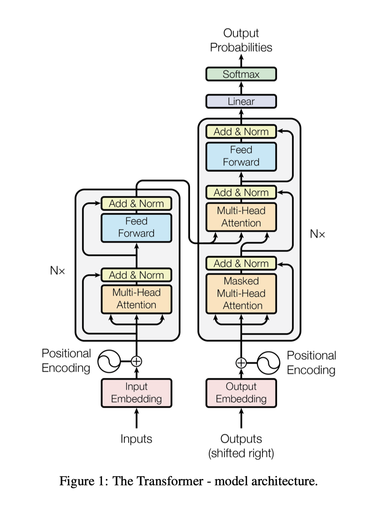
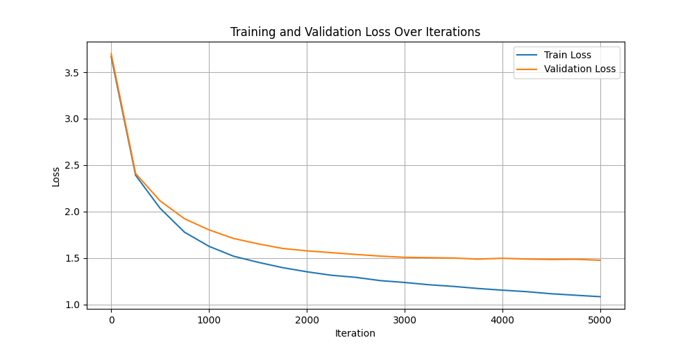

# ScratchGPT


I dived into and coded a custom implementation of a **~10.8 million parameter GPT model built from scratch** for understanding transformer architecture fundamentals. This project creates a language model trained on text data that can generate continuous text in the style of its training.

With resource help, following the paper pioneering GPT architectures and the videos of 3Blue1Brown and Andrej Karpathy, this project was an amazing opportunity to understand, recode and master the architecture of a GPT Autoregressive architecture:
- byte pair ecoding tokenization
- embedding
- multi-head self-attention mechanism
- feed-forward neural networks
- autoregressive generation


The text generated still makes approximate sense, due mostly to the fact that it implements a character level tokenization.
I am planning on recoding and implementing a sub-word level tokenization (by recoding the Byte Pair Encoding algorithm) into the model.


## Architecture

The model implements the core transformer architecture as described in "Attention Is All You Need":




### Coded and Trained Model Parameters

| **Parameter** | **Name** | **Value** | **Description** |
|-----------|-------|-------|-------------|
| **Vocabulary Size**| vocab_size | ~106 | Number of unique tokens |
| **Embedding Dimension** | n_embd | 384 | Size of token embeddings |
| **Context Length** | block_size | 256 | Maximum sequence length |
| **Batch Size** | batch_size | 64 | Samples processed per iteration |
| **Attention Heads** | n_head | 6 | Each head is 64-dimensional (384/6) |
| **Transformer Layers** | n_layer | 6 | Number of transformer blocks |


**Parameter calculation:**
- **Token embedding**: vocab_size × n_embd ≈ 106 × 384 ≈ 40 704
- **Position embedding**: block_size × n_embd = 256 × 384 ≈ 98 304
- **Self Attention**: 4 *(K,Q,V,O)* × n_layer × n_embd² ≈ 3 538 944
- **Feed Forward MLP**: n_layer × (8 × n_embd × n_embd + 4 × n_embd) ≈ 7 087 104
- **Layer Norm**: n_layer × 2 × n_embd ≈ 4 609
- **Output Layer**: n_embd × vocab_size ≈ 40 704

**Total Parameters: ~10.8 million**!

<br>

## Training Performance

The model was trained on Ecole Polytechnique's SSH GPU infrastructure with impressive results:

- Training time: ~23 minutes
- Processing speed: 5.33 iterations/second
- Final training loss: 1.0992
- Final validation loss: 1.4863




## Sample Generated Text

The model generates english poem texts after training. Here's a brief sample:

```
Her voices a rowel peace and the call,
Last the grief her man steet the mule’s between their fairls
That stretched mepentimed, never painured—
a when a firstead of the sea,
The wailes of a neat stringers,
The pend to the clase of graness and gone,
A ftear bell chere, Revengerd,
In peace out on the town the mountains.
Oh, fare were the come to the soul, Weddy all on the wear the goes not woode
The ves be toilve that past dring and made they all kissetated in proses
And the ching mossy treet my song love again
For heart he is the mountains of the love shounds fair
And if ever we hand to man soul save the fine land me,
That life only came as the bels of the Band
And who made and his sorcome for the pain.
```


## Usage and running

### Repo Structure

```
ScratchGPT/
├── src/
│   ├── main.py
│   ├── config.py
│   ├── model.py
│   ├── data.py
│   ├── trainer.py
│   ├── generate.py
│   └── bpe.py
├── media/
│   ├── bible.txt
│   ├── harrypotter.txt
│   └── poem.txt
├── merges/
│   ├── merges.txt  (will generate)
│   └── merges.json (will generate)
├── weights/
│   └── weights.pth (will generate)
├── outputs/
│   └── outputs.txt (will generate)
├── featured/
│   ├── architecture.png
│   ├── loss_plot.png
│   └── training.png
├── README.md
├── requirements.txt
├── scratchgpt.py (one file code)
└── .gitignore
```

### Training the Model

If you want to train the model:

```bash
python main.py --train --weights model.pth
```

### Generating Text

If you want to generate text from a loaded weights trained model:

```bash
python main.py --weights model.pth --output output.txt
```

### Other Usage

You can customize the model's behavior in the `config.py` file.


## License

[MIT License](LICENSE)

## Acknowledgements

This project draws inspiration from the transformer architecture described in ["Attention Is All You Need"](https://arxiv.org/abs/1706.03762) and the GPT model series by OpenAI. Additional learning resources include Andrej Karpathy's video tutorials and 3Blue1Brown explanations.